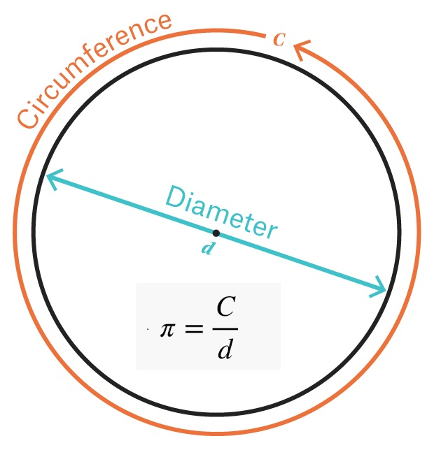
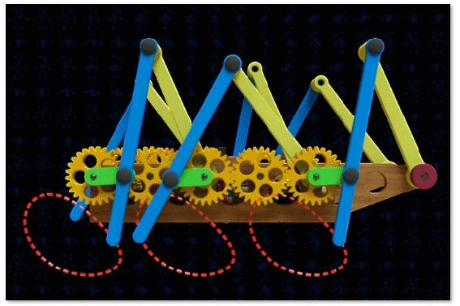
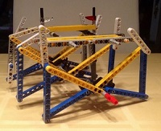
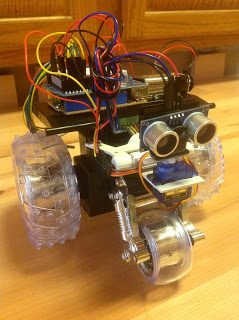

# EXYZFORMS
[HOME](https://autognorics.github.io/) 

Exyzforms are intuitive objects, shapes, systems, or forms that exhibit mechanically embedded inscriptions. The word was derived from the Greek "exypnos" which means wise and "morfes zois" which means life forms. Exyzforms are the missing links, the fundamental units, the nuts and bolts in the actualization of creating a living machine that is alive, aware, conscious, intuitive, and neural ( knowledge originating from within the organism).

By integrating intuitive objects with latent inscriptions into a system, a new life form of silver species known as ELFS (engineered life-forms) can be created. These Intuitive Machines (I.M.) with life are not governed by A.I. (artificial intelligence) or M.L. (machine learning) but by I.Os (intuitive objects) and E.Is (embedded inscriptions).

In the [video](https://www.youtube.com/watch?v=yd4qjQkjs8o&feature=emb_title), the machine is animated not because it was computer programmed by a set of instructions but because it was mechanically programmed by its designs, structures, and materials. The machine programmed itself through the natural phenomena called Inscription by Design a.k.a I.D. The machine moves in a circular motion by itself due to I.D. and not by any computer programs.

## Examples of Intuitive Objects with Embedded Inscriptions:

### Intuitive Shape
 

### Intuitive Form
 

### Intuitive Object
 

### Intuitive System
 

### Inscription by Design
[Proof of Concept](https://www.youtube.com/watch?v=1ts3hzaGPNg)

> "Intuitive Objects always come with Elegant Equations." ~ Joey Lawsin
